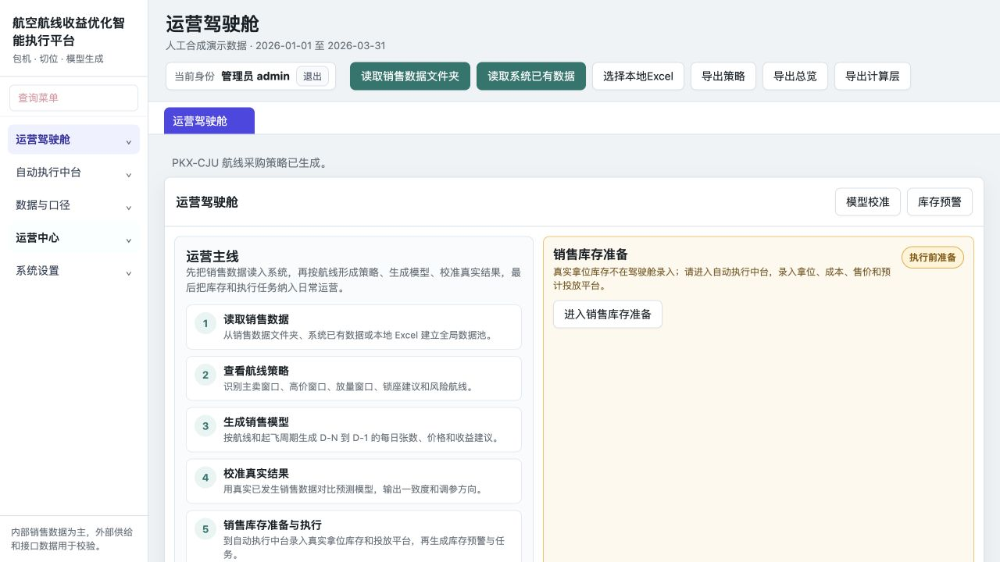
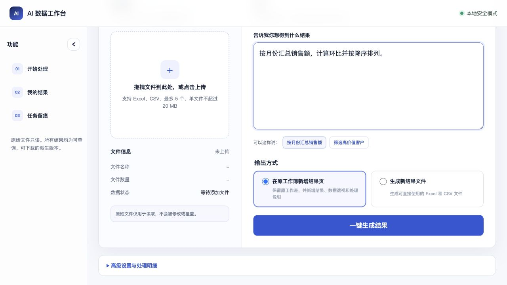
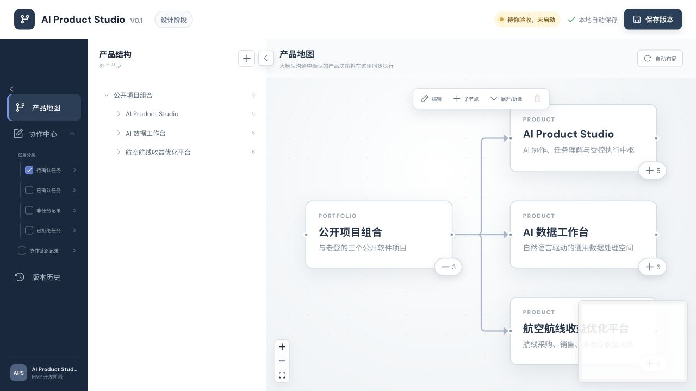

<!-- GitHub profile README -->

# 与老登

航空从业者，不是程序员。正在记录我怎样和 AI 一起，把真实业务经验变成能运行的软件。

**English:** Airline operator building real, testable software with AI—focused on airline sales, local-first data work, and approval-gated execution.

以前，一套航空销售系统往往投入上百万元、开发半年以上。我从不会写代码开始，与 ChatGPT、Codex 协作，不到两个月做出了航空销售系统初型，并逐步建立数据处理和 AI 协作工具。

这里不展示虚构概念，只放经过当前测试、能够说明真实边界的项目。

## 从这里开始 / Start here

1. [在线了解航空销售智能执行平台](https://yglaodeng.github.io/airline-sales-intelligence/) — 航线策略、库存预警与 Mock OTA 验证
2. [AI 数据工作台](https://github.com/yglaodeng/ai-data-workbench) — 自然语言目标、原始文件只读、结果可追溯
3. [AI Product Studio](https://github.com/yglaodeng/ai-product-studio) — 人工确认、受控执行、结果回传

## 公开项目

### [航空销售智能执行平台](https://github.com/yglaodeng/airline-sales-intelligence)

从航线销售经验出发，覆盖策略、销售节奏、库存预警、运营台账和 Mock OTA 模拟闭环。

[在线查看项目介绍](https://yglaodeng.github.io/airline-sales-intelligence/) · [查看源码](https://github.com/yglaodeng/airline-sales-intelligence)

状态：可运行系统初型，模拟流程验证。

### [AI 数据工作台](https://github.com/yglaodeng/ai-data-workbench)

上传表格并描述目标，通过人工确认、处理预览和结果导出完成通用数据任务，同时保护原始文件。

状态：本地可用，持续迭代。

### [AI Product Studio](https://github.com/yglaodeng/ai-product-studio)

把对话中的任务理解、人工确认、受控执行、测试和结果回传组织成可追踪流程。

状态：受控本地原型，人工确认执行。

## 我正在记录什么

- 一个航空从业者怎样学习使用 AI
- 怎样把业务经验说清楚，让 AI 帮助开发
- 从需求、测试到发布，真实过程里遇到的问题
- 哪些功能已经跑通，哪些仍然只是原型

仓库展示的是源码和本地运行方法，目前不等于在线云端服务。需要全天候公开体验时，还要单独完成云部署、安全和数据保护。

当前仓库未附加开源许可证。如需交流或使用，请先通过 GitHub Issue 联系。
